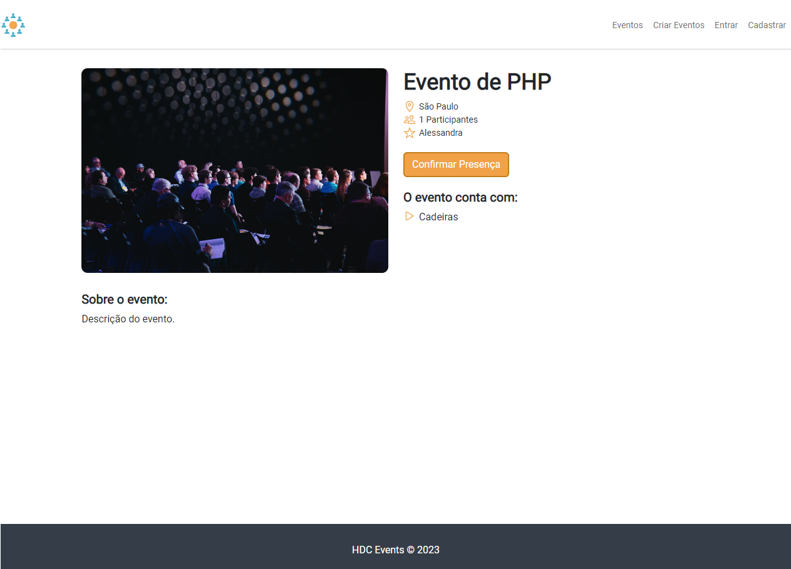
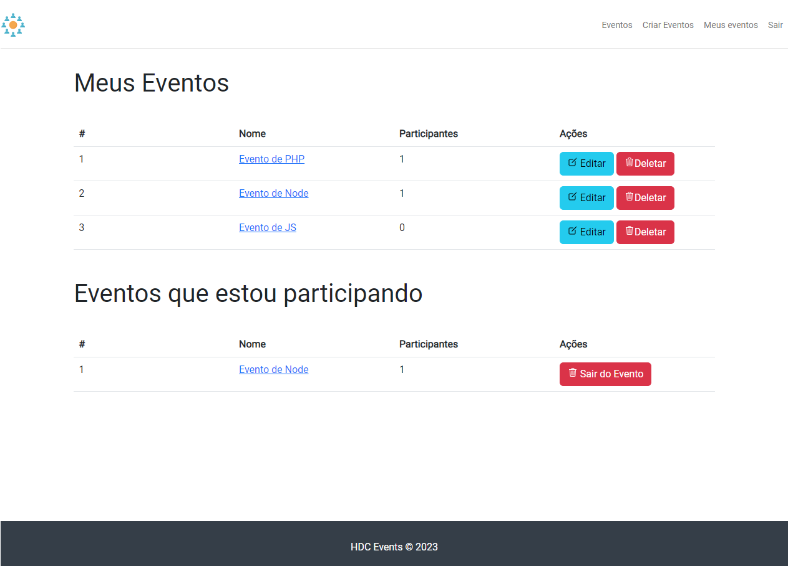
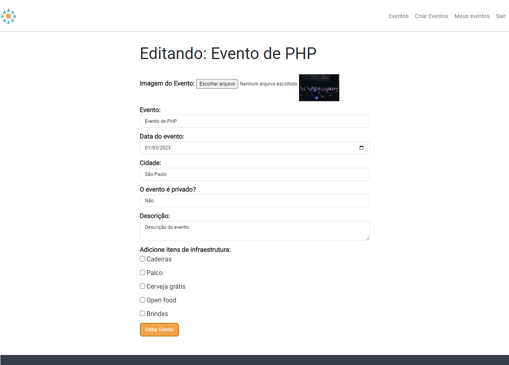

### Aplicação CRUD em Laravel 9 (projeto de estudo)

## 🏠 Página Inicial

    <kbd>
        
    </kbd>

## 🎯 Exibindo um evento

    <kbd>
        
    </kbd>

## 📊 Dashboard

    <kbd>
        
    </kbd>

## 📝 Editando um evento

    <kbd>
        
    </kbd>

## 🔍 Buscando um evento

    <kbd>
        
    </kbd>

